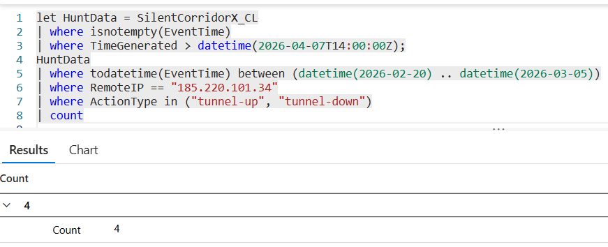

# Flag 04 – Connection Footprint

## Question
HUNT LEAD: "That IP failed then succeeded. Scope the full picture for this account across the window."

## Answer
4
## Screenshot

## Finding
The suspicious IP address 185.220.101.34 generated four VPN session events during the attack window, consisting of two Tunnel Up and two Tunnel Down events. This confirmed that the account associated with the IP successfully established multiple SSL VPN sessions after earlier failed authentication attempts.
