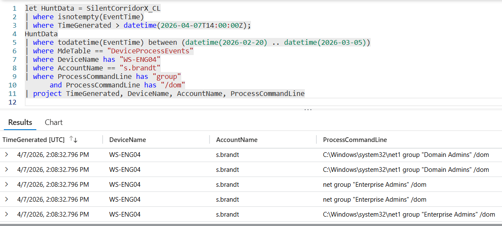

# Flag 01 – Directory Enumeration

## Question
HUNT LEAD: "What did they go after first? If they're mapping the environment, I need to know what they found." 

## Answer
Domain Admins,Enterprise Admins

## Screenshot

## Finding
Investigation of process execution activity on the compromised workstation WS-ENG04 identified Active Directory reconnaissance activity performed under the suspicious user session. The attacker executed domain group enumeration commands targeting the Domain Admins and Enterprise Admins groups shortly after establishing access.
