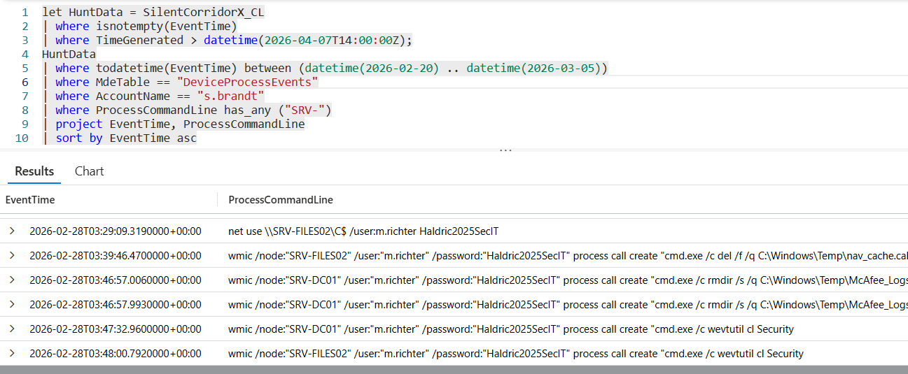

# Flag 09 – Network Reconnaissance

## Question
HUNT LEAD: "They know who the admins are. What infrastructure did they map next?"

## Answer
SRV-DC01,SRV-FILES02

## Screenshot

## Finding
Following successful access to the engineering workstation WS-ENG04, the attacker performed additional infrastructure reconnaissance targeting critical internal systems. Process execution logs showed references to the hosts SRV-DC01 and SRV-FILES02, indicating the attacker had identified and begun interacting with both the domain controller and a central file server.
