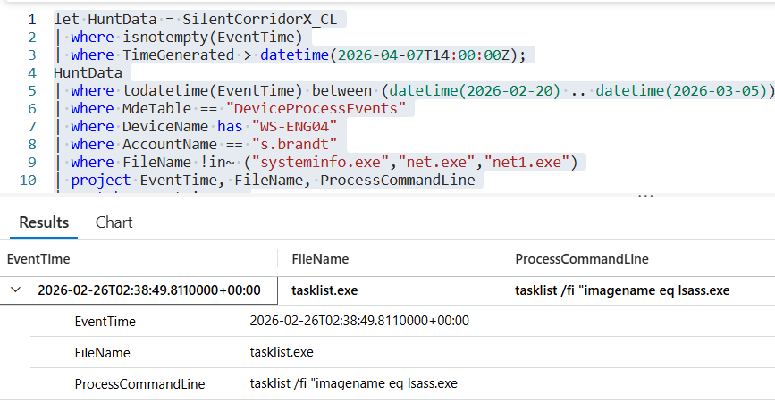

# Flag 10 – First Credential Activity

## Question
HUNT LEAD: "Parallel track. That VPN account alone isn't getting them to those servers. They need more.

## Answer
tasklist /fi "imagename eq lsass.exe" 

## Screenshot

## Finding
Process execution analysis on the compromised workstation WS-ENG04 identified early attacker interest in authentication-related processes. The command tasklist /fi "imagename eq lsass.exe" was executed under the compromised user session, indicating the attacker was specifically searching for the Local Security Authority Subsystem Service (lsass.exe). This behavior is commonly associated with credential access activity because LSASS stores authentication material and active user credential data in memory. The activity occurred prior to subsequent SAM and NTDS-related actions, suggesting the attacker was preparing for credential theft and privilege escalation operations within the environment.

