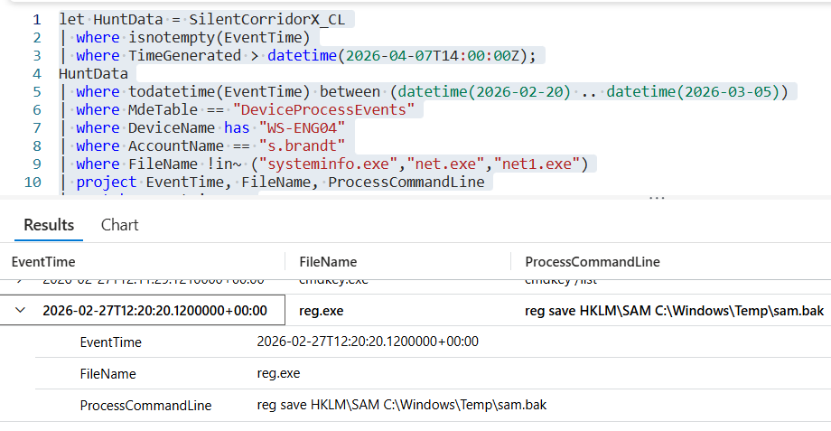

# Flag 11 – Credential Dump Outcome

## Question
HUNT LEAD: "What happened next in the timeline? Did they get what they wanted?"

## Answer
No/none

## Screenshot

## Finding
The attacker attempted to dump credential material using the command reg save HKLM\SAM C:\Windows\Temp\sam.bak, but the expected output file sam.bak was not created. No intervening process was observed between the dump attempt and the failed result, indicating the attempt did not successfully produce the credential dump file. The attacker attempted to copy sensitive password data from the Windows SAM database into a file named sam.bak. However, the file was never successfully created, meaning the attempt failed. Investigators also confirmed that no other process or security tool interrupted the action, which is why the result was recorded as NO/none.

