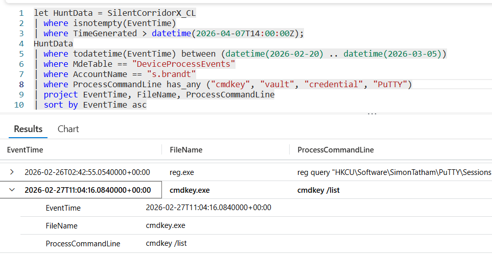

# Flag 13 – Saved Credentials

## Question
HUNT LEAD: "Keep going. Anything else related to stored credentials on this box?"

## Answer
cmdkey /list

## Screenshot

## Finding
Analysis of process execution activity on the compromised workstation WS-ENG04 identified additional credential discovery behavior targeting locally stored authentication material. The attacker executed the command: cmdkey /list. This command enumerates credentials stored by Windows Credential Manager, including saved usernames and authentication entries used for remote systems, network shares, and other services. Such activity suggests the attacker was attempting to identify reusable credentials already present on the host to support privilege escalation or lateral movement. This behavior, combined with prior LSASS targeting and SAM hive access attempts, demonstrates a clear effort to harvest credential material and expand access within the environment.

