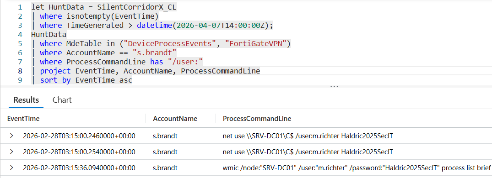

# Flag 15 – New Account Observed

## Question
HUNT LEAD: "Different account in that command. That confirms the credential theft worked. Who?"

## Answer
m.richter

## Screenshot

## Finding
The investigation began by confirming that all hunt telemetry was stored in the Sentinel custom log table `SilentCorridorX_CL`. This table served as the primary data source for the investigation.

