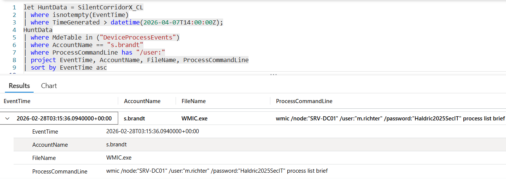

# Flag 16 – Cross-Host Spawning

## Question
HUNT LEAD: "Pivot to the target. Are there commands running on it that shouldn't be?
How are they getting there?" 

## Answer
WMIC

## Screenshot

## Finding
Investigation of activity on the target infrastructure systems identified unauthorized remote command execution originating from the compromised environment. Analysis showed the attacker repeatedly used WMIC (wmic.exe) with stolen credentials belonging to m.richter to execute commands on systems such as SRV-DC01 and SRV-FILES02. Commands were issued using process call create, enabling the attacker to remotely launch processes without requiring direct interactive access to the target hosts.

