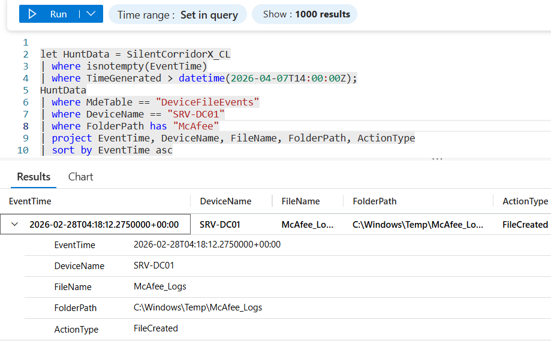

# Flag 17 – New Filesystem Activity

## Question
HUNT LEAD: "Check the target host directly. Anything new on the filesystem that wasn't there before?
What's the full path?"

## Answer
C:\Windows\Temp\McAfee_Logs

## Screenshot

## Finding
File system analysis on the target host SRV-DC01 identified the creation of an unauthorized staging directory: C:\Windows\Temp\McAfee_Logs Investigation determined that this directory was not associated with any legitimate software deployed within the Haldric Aerospace environment. The folder was created through a remotely executed WMIC command using the compromised credentials of m.richter. The directory appeared to serve as a temporary staging location for attacker activity and was linked to subsequent ntdsutil operations intended to collect Active Directory data. The use of a misleading directory name resembling a legitimate security product suggests an attempt to blend malicious activity with normal system artifacts and evade detection.

