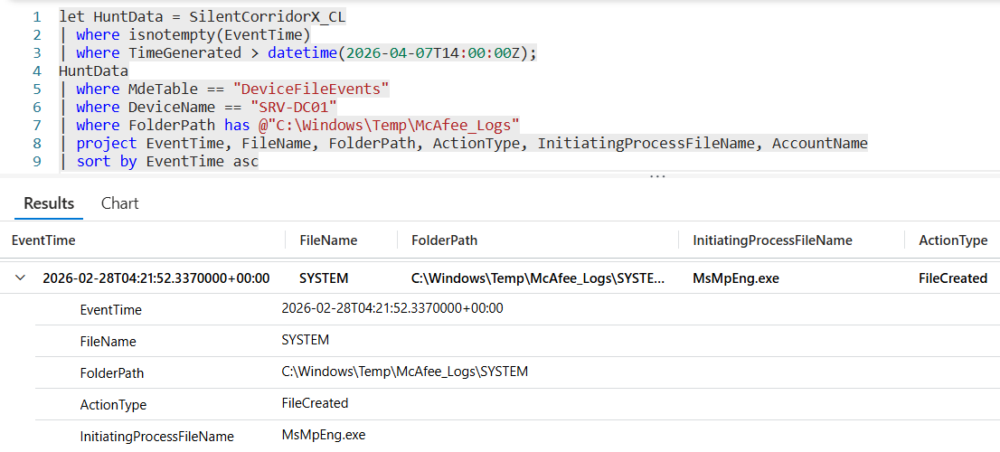

# Flag 19 – Concurrent File Access

## Question
HUNT LEAD: "Check the file events around the same moment those files appeared. Did anything else interact with them?"

## Answer
MsMpEng.exe

## Screenshot

## Finding
TInvestigation of SRV-DC01 identified the creation of an unauthorized staging directory, C:\Windows\Temp\McAfee_Logs, containing sensitive files including ntds.dit and the SYSTEM hive. Shortly after the files were created, MsMpEng.exe (Microsoft Defender Antivirus) interacted with them, indicating that endpoint security tools detected or scanned the credential-related artifacts during the attacker’s collection activity. MsMpEng.exe is the Microsoft Defender Antivirus engine process. Its activity indicates that endpoint security tooling detected or scanned the newly created files shortly after they appeared on disk. 

