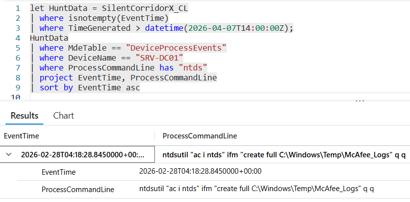

# Flag 20 – Database File Access

## Question
HUNT LEAD: "It saw them and didn't act. We'll deal with that policy gap later.
The file they took is locked by the OS while the service runs. How did they get a copy out?"

## Answer
ntdsutil

## Screenshot

## Finding
Investigation of activity on SRV-DC01 revealed that the attacker used ntdsutil to obtain a copy of the Active Directory database. Because ntds.dit is normally locked by the operating system while Active Directory services are running, it cannot be copied directly through standard file operations. By leveraging ntdsutil with Install From Media (IFM) functionality, the attacker created an accessible copy of the database and staged it within the unauthorized C:\Windows\Temp\McAfee_Logs directory. This technique enabled the collection of sensitive Active Directory credential data while bypassing normal file-locking restrictions and is commonly associated with credential theft and domain compromise activity.

