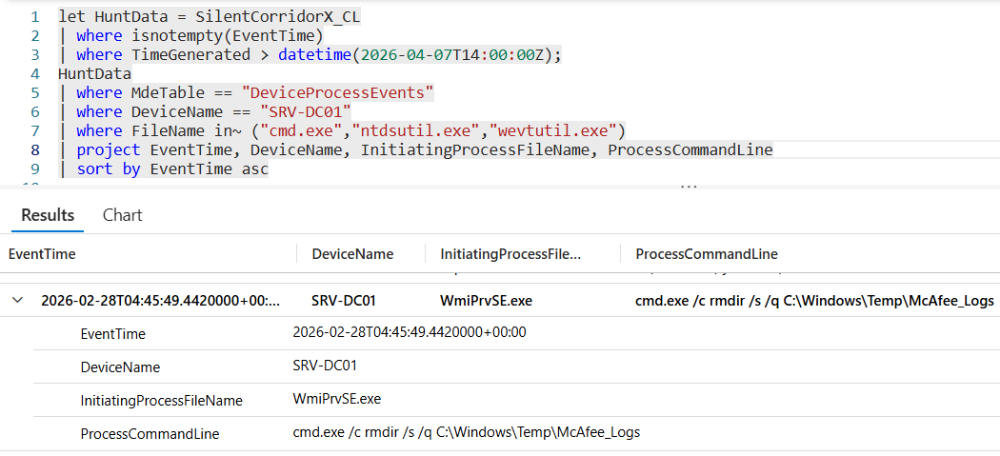

# Flag 21 – Spawning Source

## Question
HUNT LEAD: "The commands on that host weren't run by anyone at the console. Something is spawning them, and the trigger is coming from somewhere else.
What's the spawning process and the originating host?"

## Answer
WmiPrvSE.exe/WS-ENG04

## Screenshot

## Finding
Investigation of SRV-DC01 showed that malicious commands were not executed locally but were remotely spawned through WmiPrvSE.exe, indicating WMI-based remote execution. Analysis confirmed the commands originated from the compromised workstation WS-ENG04, demonstrating attacker lateral movement using legitimate Windows administration tools and stolen credentials.

