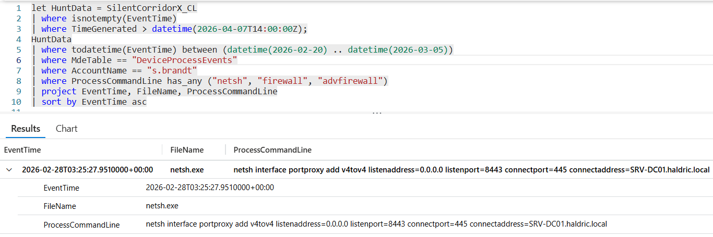

# Flag 23 – Network Configuration Change

## Question
HUNT LEAD: "Check the beachhead for network configuration changes that shouldn't be there."

## Answer
netsh  interface portproxy add v4tov4 listenaddress=0.0.0.0 listenport=8443 connectport=445 connectaddress=SRV-DC01.haldric.local

## Screenshot

## Finding
Analysis of WS-ENG04 identified unauthorized network configuration changes through a netsh interface portproxy command. The attacker configured a listener on port 8443 and redirected traffic to SRV-DC01 over SMB (445). This created a covert pivot path through the compromised workstation, enabling indirect access to the domain controller and supporting persistent lateral movement activity.

