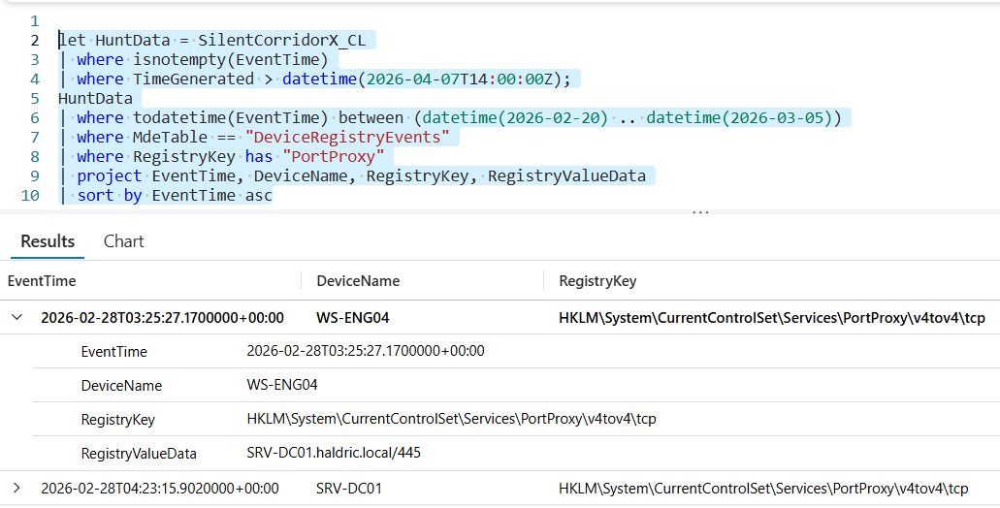

# Flag 24 – Configuration Storage

## Question
HUNT LEAD: "Does that change survive a reboot? Where is it stored?"

## Answer
HKLM\SYSTEM\CurrentControlSet\Services\PortProxy\v4tov4\tcp

## Screenshot

## Finding
Investigation confirmed that the attacker’s netsh interface portproxy configuration was persistent and stored in: HKLM\SYSTEM\CurrentControlSet\Services\PortProxy\v4tov4\tcp.This allowed the port forwarding rule to survive reboots, creating a long-term access path that supported persistence and continued lateral movement within the environment.

