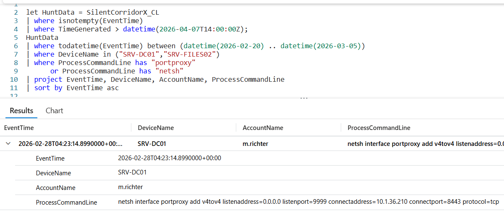

# Flag 25 – Matching Configuration on DC

## Question
HUNT LEAD: "Check the other compromised hosts for the same kind of change."

## Answer
netsh  interface portproxy add v4tov4 listenaddress=0.0.0.0 listenport=9999 connectaddress=10.1.36.210 connectport=8443 protocol=tcp

## Screenshot

## Finding
The Investigation identified additional unauthorized netsh interface portproxy configurations on other compromised hosts. The repeated use of PortProxy rules indicates the attacker established multiple persistent network redirection paths to maintain access and support continued lateral movement throughout the environment.

