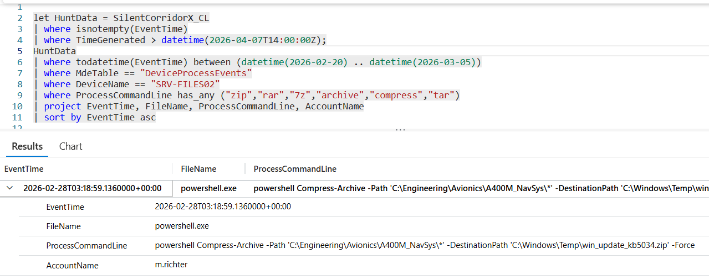

# Flag 26 – Targeted Directory

## Question
HUNT LEAD: "Persistence confirmed. Now the worst question. What directory on the file server did they go after?"

## Answer
C:\Engineering\Avionics\A400M_NavSys

## Screenshot

## Finding
The Investigation on SRV-FILES02 revealed that the attacker targeted the directory C:\Engineering\Avionics\A400M_NavSys, compressing its contents into an archive and later encoding it with certutil. This sequence indicates deliberate collection and preparation of sensitive avionics data for potential exfiltration, consistent with intellectual property theft activity.

