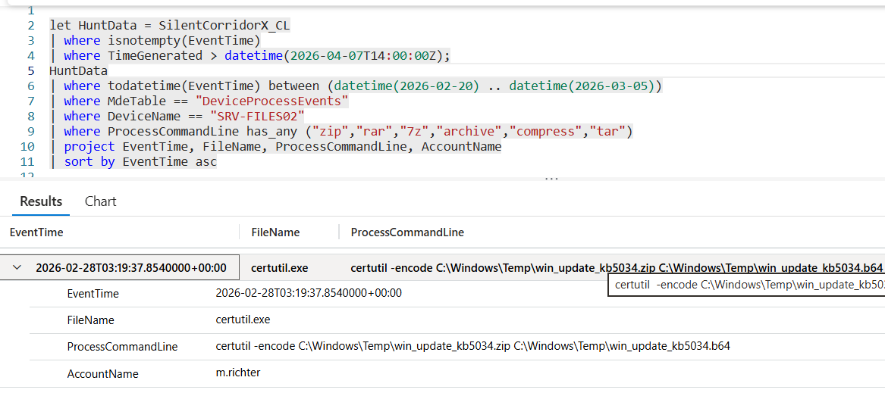

# Flag 29 – Format Conversion

## Question
HUNT LEAD: "Binary files don't transit well. They would have converted it first. What did they use?"

## Answer
certutil

## Screenshot

## Finding
The Investigation identified the use of certutil to convert the archived avionics data into a Base64-encoded file (win_update_kb5034.b64). By encoding the archive after creating win_update_kb5034.zip, the attacker prepared the data for easier transfer and potential evasion of basic detection controls. This behavior demonstrates a deliberate exfiltration workflow and further supports evidence of intellectual property theft activity.

