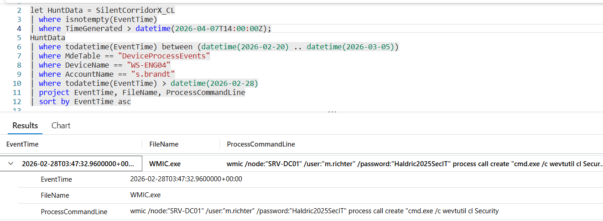

# Flag 33 – First Cleanup Action

## Question
HUNT LEAD: "Last phase. They came back to clean up. Check all three hosts.
What did they target first?"

## Answer
wevtutil  cl Security

## Screenshot

## Finding
Investigation identified anti-forensics activity across compromised systems during the attacker’s return phase. The earliest cleanup action targeted SRV-DC01, where the attacker used WMIC with stolen credentials to remotely execute wevtutil cl Security, clearing Windows Security event logs. This activity indicates an attempt to remove evidence of malicious actions and reduce forensic visibility across compromised infrastructure.

