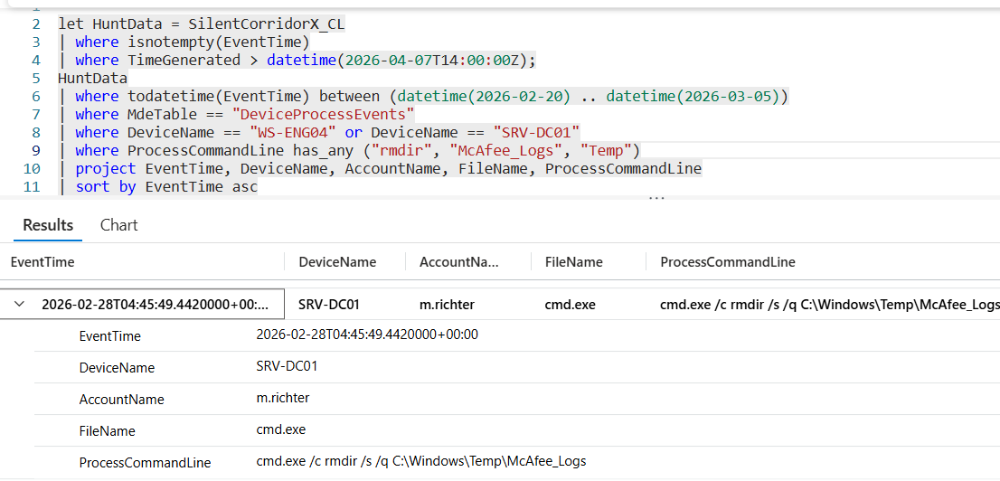

# Flag 37 – DC Staging Cleanup

## Question
HUNT LEAD: "Logs weren't the only cleanup. Check SRV-DC01 for staging artefact removal."

## Answer
cmd.exe /c rmdir /s /q C:\Windows\Temp\McAfee_Logs

## Screenshot

## Finding
The Investigation of SRV-DC01 identified cleanup activity targeting attacker-created staging artifacts. The command: cmd.exe /c rmdir /s /q C:\Windows\Temp\McAfee_Logs was used to silently and recursively remove the McAfee_Logs directory, which previously contained credential theft artifacts including ntds.dit and the SYSTEM hive. This behavior indicates an anti-forensics effort to remove evidence of staging and credential collection activity following completion of attacker objectives.

