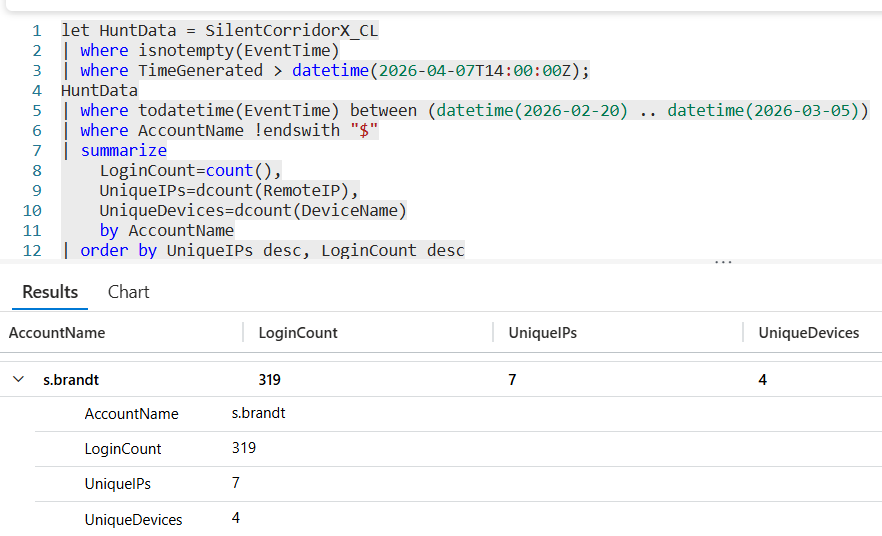

# Flag 02 – Suspicious Account

## Question
HUNT LEAD: "The advisory says previous victims were compromised through remote access infrastructure. Profile every account. Find the one that doesn't fit."

## Answer
s.brandt

## Screenshot

## Finding
I profiled remote access activity for all user accounts during the advisory attack window and compared login frequency, unique remote IP usage, and the number of devices accessed. One account stood out by accessing four unique devices, whereas other accounts typically accessed significantly 3 systems. This deviation from normal user behavior suggested possible credential misuse or lateral movement activity and warranted deeper investigation.
