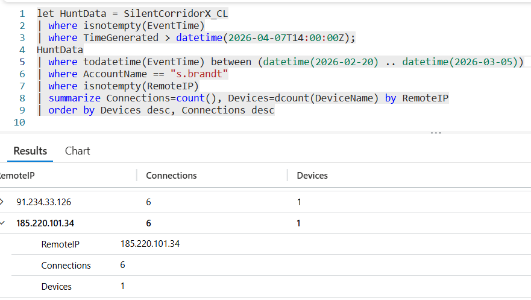

# Flag 03 – Origin of Failed Auth

## Question
HUNT LEAD: "Could be a busy employee. Could be someone else using their credentials.
Prove it one way or the other."

## Answer
185.220.101.34

## Screenshot

## Finding
The IPv4 address 185.220.101.34 was identified as suspicious during remote access profiling. Although the address generated only six connections, it stood out because it was associated with abnormal user behavior and remote access activity inconsistent with typical employee patterns. 
